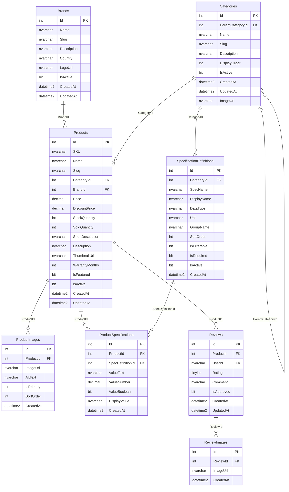
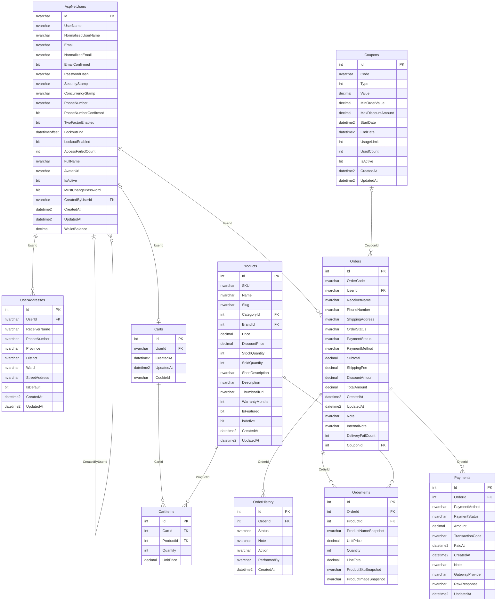
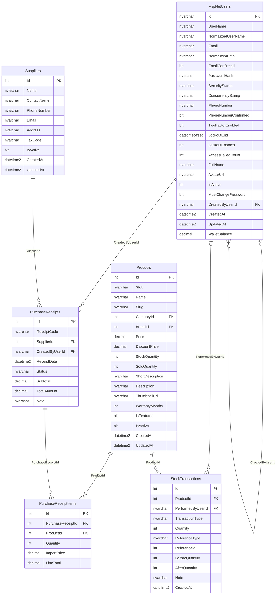
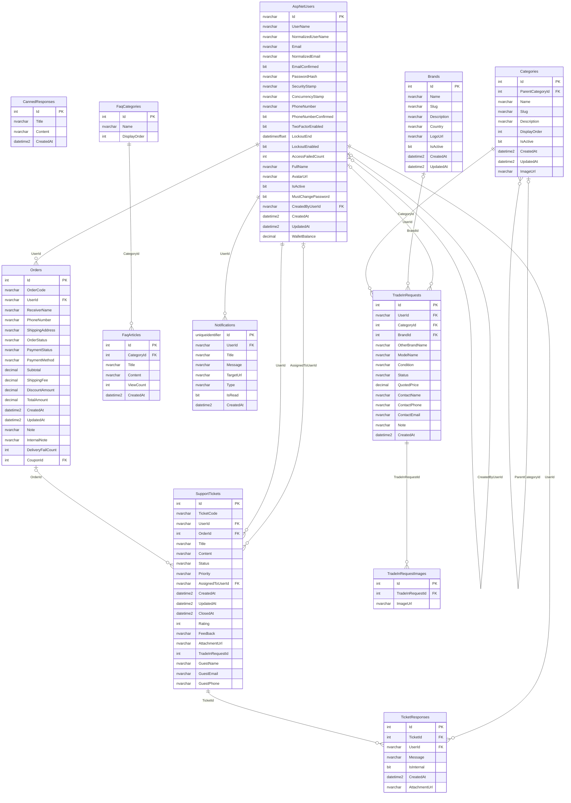
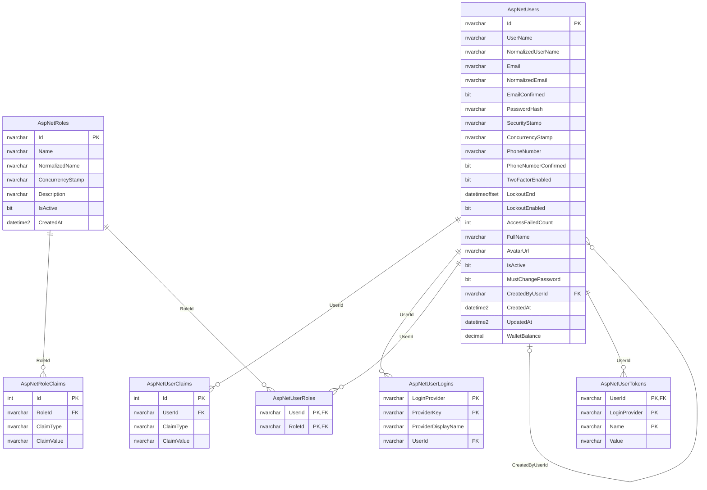

# Sơ đồ ERD – TechZoneStoreDb (PowerTech)

> Sinh tự động từ `data.sql` bằng `database/tools/gen_erd.py`. Mở bằng GitHub, VS Code (Markdown Preview Mermaid) hoặc https://mermaid.live.

**36 bảng, 44 khóa ngoại.** Ký hiệu: `||--o{` = bắt buộc một – nhiều, `|o--o{` = khóa ngoại cho phép NULL, `||--o|` = một – một (FK có unique index).

## 1. Toàn cảnh (chỉ khóa chính / khóa ngoại)

```mermaid
erDiagram
    Orders {
        int Id PK
        nvarchar UserId FK
        int CouponId FK
    }
    AspNetUsers {
        nvarchar Id PK
        nvarchar CreatedByUserId FK
    }
    OrderItems {
        int Id PK
        int OrderId FK
        int ProductId FK
    }
    Categories {
        int Id PK
        int ParentCategoryId FK
    }
    Brands {
        int Id PK
    }
    Products {
        int Id PK
        int CategoryId FK
        int BrandId FK
    }
    StockTransactions {
        int Id PK
        int ProductId FK
        nvarchar PerformedByUserId FK
    }
    Payments {
        int Id PK
        int OrderId FK
    }
    SupportTickets {
        int Id PK
        nvarchar UserId FK
        int OrderId FK
        nvarchar AssignedToUserId FK
    }
    AspNetRoles {
        nvarchar Id PK
    }
    Suppliers {
        int Id PK
    }
    PurchaseReceipts {
        int Id PK
        int SupplierId FK
        nvarchar CreatedByUserId FK
    }
    AspNetUserRoles {
        nvarchar UserId PK,FK
        nvarchar RoleId PK,FK
    }
    PurchaseReceiptItems {
        int Id PK
        int PurchaseReceiptId FK
        int ProductId FK
    }
    __EFMigrationsHistory {
        nvarchar MigrationId PK
    }
    AspNetRoleClaims {
        int Id PK
        nvarchar RoleId FK
    }
    AspNetUserClaims {
        int Id PK
        nvarchar UserId FK
    }
    AspNetUserLogins {
        nvarchar LoginProvider PK
        nvarchar ProviderKey PK
        nvarchar UserId FK
    }
    AspNetUserTokens {
        nvarchar UserId PK,FK
        nvarchar LoginProvider PK
        nvarchar Name PK
    }
    CannedResponses {
        int Id PK
    }
    CartItems {
        int Id PK
        int CartId FK
        int ProductId FK
    }
    Carts {
        int Id PK
        nvarchar UserId FK
    }
    Coupons {
        int Id PK
    }
    FaqArticles {
        int Id PK
        int CategoryId FK
    }
    FaqCategories {
        int Id PK
    }
    Notifications {
        uniqueidentifier Id PK
        nvarchar UserId FK
    }
    OrderHistory {
        int Id PK
        int OrderId FK
    }
    ProductImages {
        int Id PK
        int ProductId FK
    }
    ProductSpecifications {
        int Id PK
        int ProductId FK
        int SpecDefinitionId FK
    }
    ReviewImages {
        int Id PK
        int ReviewId FK
    }
    Reviews {
        int Id PK
        int ProductId FK
        nvarchar UserId FK
    }
    SpecificationDefinitions {
        int Id PK
        int CategoryId FK
    }
    TicketResponses {
        int Id PK
        int TicketId FK
        nvarchar UserId FK
    }
    TradeInRequestImages {
        int Id PK
        int TradeInRequestId FK
    }
    TradeInRequests {
        int Id PK
        nvarchar UserId FK
        int CategoryId FK
        int BrandId FK
    }
    UserAddresses {
        int Id PK
        nvarchar UserId FK
    }
    AspNetRoles ||--o{ AspNetRoleClaims : "RoleId"
    AspNetUsers ||--o{ AspNetUserClaims : "UserId"
    AspNetUsers ||--o{ AspNetUserLogins : "UserId"
    AspNetRoles ||--o{ AspNetUserRoles : "RoleId"
    AspNetUsers ||--o{ AspNetUserRoles : "UserId"
    AspNetUsers |o--o{ AspNetUsers : "CreatedByUserId"
    AspNetUsers ||--o{ AspNetUserTokens : "UserId"
    Carts ||--o{ CartItems : "CartId"
    Products ||--o{ CartItems : "ProductId"
    AspNetUsers |o--o| Carts : "UserId"
    Categories |o--o{ Categories : "ParentCategoryId"
    FaqCategories ||--o{ FaqArticles : "CategoryId"
    AspNetUsers ||--o{ Notifications : "UserId"
    Orders ||--o{ OrderHistory : "OrderId"
    Orders ||--o{ OrderItems : "OrderId"
    Products ||--o{ OrderItems : "ProductId"
    AspNetUsers ||--o{ Orders : "UserId"
    Coupons |o--o{ Orders : "CouponId"
    Orders ||--o{ Payments : "OrderId"
    Products ||--o{ ProductImages : "ProductId"
    Brands ||--o{ Products : "BrandId"
    Categories ||--o{ Products : "CategoryId"
    Products ||--o{ ProductSpecifications : "ProductId"
    SpecificationDefinitions ||--o{ ProductSpecifications : "SpecDefinitionId"
    Products ||--o{ PurchaseReceiptItems : "ProductId"
    PurchaseReceipts ||--o{ PurchaseReceiptItems : "PurchaseReceiptId"
    AspNetUsers ||--o{ PurchaseReceipts : "CreatedByUserId"
    Suppliers ||--o{ PurchaseReceipts : "SupplierId"
    Reviews ||--o{ ReviewImages : "ReviewId"
    AspNetUsers ||--o{ Reviews : "UserId"
    Products ||--o{ Reviews : "ProductId"
    Categories ||--o{ SpecificationDefinitions : "CategoryId"
    AspNetUsers |o--o{ StockTransactions : "PerformedByUserId"
    Products ||--o{ StockTransactions : "ProductId"
    AspNetUsers |o--o{ SupportTickets : "AssignedToUserId"
    AspNetUsers ||--o{ SupportTickets : "UserId"
    Orders |o--o{ SupportTickets : "OrderId"
    AspNetUsers ||--o{ TicketResponses : "UserId"
    SupportTickets ||--o{ TicketResponses : "TicketId"
    TradeInRequests ||--o{ TradeInRequestImages : "TradeInRequestId"
    AspNetUsers |o--o{ TradeInRequests : "UserId"
    Brands |o--o{ TradeInRequests : "BrandId"
    Categories ||--o{ TradeInRequests : "CategoryId"
    AspNetUsers ||--o{ UserAddresses : "UserId"
```

## 2. Danh mục sản phẩm

## 3. Bán hàng

## 4. Kho và nhập hàng

## 5. Hỗ trợ khách hàng và thu cũ đổi mới

## 6. Tài khoản và phân quyền (ASP.NET Identity)

## Ghi chú thiết kế

- `Orders` lưu **snapshot** người nhận/địa chỉ; `OrderItems` lưu snapshot tên, SKU, ảnh sản phẩm nên đổi `Products` không làm đổi đơn cũ.
- `StockTransactions.ReferenceType` + `ReferenceId` là tham chiếu **đa hình** (không có FK): `PurchaseReceipt` → `PurchaseReceipts.Id`.
- Không có FK trong DB cho: `SupportTickets.TradeInRequestId` (chỉ là cột tham chiếu), `OrderHistory.PerformedBy` (chuỗi tự do, ví dụ `Shipper: email`), `Orders.CouponId` có FK nhưng `Coupons.UsedCount` là số đếm lưu sẵn.
- Các view `vw_Report_*`, `vw_AdminDashboard_*` và proc `sp_Report_*` đọc từ Orders, OrderItems, Products, Categories, Brands, StockTransactions, PurchaseReceipts, SupportTickets (không vẽ trong ERD).